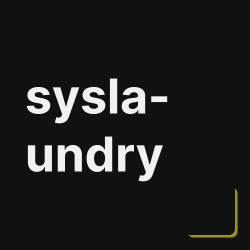

<div align="center">
  
  
  <h3><b>syslaundry</b></h3>
</div>

# 📗 Table of Contents
- [📖 About the Project](#about-project)
  - [⚙️ Production (done)](#production)
    - [Tech Stack](#tech-stack)
    - [Key Features](#key-features)
  - [🚀 Live Demo](#live-demo)
- [💻 Getting Started](#getting-started)
  - [Prerequisites](#prerequisites)
  - [Installation](#installation)
  - [Usage](#usage)
- [🤝 Contributing](#contributing)
- [📝 License](#license)

<br>


# 📖 syslaundry <a name="about-project"></a>
**syslaundry** is an application developed using Java as part of a university assignment. This project was designed to demonstrate core programming skills and knowledge acquired throughout the course. 

- **This project is part of a university assignment.**

## ⚙️ Production (done)<a name="production"></a>
This project progressed over the **course of one weeks** before its public release, following several key stages: starting with finding the core idea, implementing it using Java, and refining the functionality to meet the project requirements.

### Tech Stack <a name="tech-stack"></a>
- Basic Java knowledge
- NaN
### Key Features <a name="key-features"></a>
- **Minimalist Design**: Utilizes basic Java syntaxes.
- **NaN**:NaN
<p align="right">(<a href="#readme-top">back to top</a>)</p>


## 🚀 Live Demo <a name="live-demo"></a>
Sadly, this project is **not available** on any website. 
<p align="right">(<a href="#readme-top">back to top</a>)</p>


## 💻 Getting Started <a name="getting-started"></a>
To get a local copy up and running, follow these steps.

### Prerequisites
- Clone this project at your directory.
```sh
git clone https://github.com/d1azdn/syslaundry
```

### Install
- To convert java, go to folder /src then run the following commands:
```sh
javac Main.java
```

### Usage
- To run the project, go to folder /src then run the following commands:
```sh
java Main
```
<p align="right">(<a href="#readme-top">back to top</a>)</p>


## 🤝 Contributing <a name="contributing"></a>
Contributions, issues, and feature requests are welcome!
Feel free to check the [issues page](../../issues/).
<p align="right">(<a href="#readme-top">back to top</a>)</p>


## 📝 License <a name="license"></a>
This project is [MIT](./LICENSE) licensed.

_NOTE: we recommend using the [MIT license](https://choosealicense.com/licenses/mit/) - you can set it up quickly by [using templates available on GitHub](https://docs.github.com/en/communities/setting-up-your-project-for-healthy-contributions/adding-a-license-to-a-repository). You can also use [any other license](https://choosealicense.com/licenses/) if you wish._

<p align="right">(<a href="#readme-top">back to top</a>)</p>
